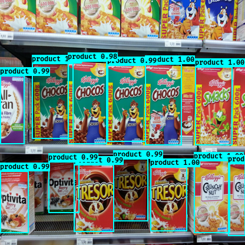

# Grocery products recognition

Hello and welcome to this projet. 

This git trains a YOLOv2 algorithm in order to localize the grocery products in the supermarket shell.

The following dataset is used to train this CNN:
[Grocery Store dataset](https://www.amazon.de/clouddrive/share/J3OaZMNnhBpKG28mAfs5CqTgreQxFCY8uENGaIk7H3s?_encoding=UTF8&mgh=1&ref_=cd_ph_share_link_copy).

This dataset was annotated in the work by [George, Marian and Floerkemeier](http://vision.disi.unibo.it/index.php?option=com_content&view=article&id=111&catid=78). (There is only 76 images annotated.)

The Yolo (You Only Look Once) algorithm is presented in the following papers:
* Redmon et al., 2016 (https://arxiv.org/abs/1506.02640) 
* Redmon and Farhadi, 2016 (https://arxiv.org/abs/1612.08242).

The yolo algorithm was originally tested in [Darknet]( https://pjreddie.com/darknet). This algorithm has been implemented in python for several machine-learning frameworks. This work is based in the [YAD2K]( https://github.com/allanzelener/YAD2K) implementation for Keras and Tensorflow.

## Getting Started

In order to test this project please follow the notebooks in this order:
* Data_preprocess_for_products_recognition
* Train_tiny_yolo_Products_recognition
* Test_tiny_yolo_Products_recognition

### Requirements

What things you need to install the software and how to install them

- [Keras](https://github.com/fchollet/keras)
- [Tensorflow](https://www.tensorflow.org/)
- [Numpy](http://www.numpy.org/)
- [h5py](http://www.h5py.org/) (For Keras model serialization.)
- [Pillow](https://pillow.readthedocs.io/) (For rendering test results.)
- [Python 3](https://www.python.org/)
- [pydot-ng](https://github.com/pydot/pydot-ng) (Optional for plotting model.)
- [wget](https://pypi.python.org/pypi/wget)
- [zipfile](https://pymotw.com/2/zipfile/)

## Authors

* **Andres OSPINA** - *Initial work* - [AndresOsp](https://github.com/AndresOsp/)

## Acknowledgments

- [Darknet](https://github.com/pjreddie/darknet) 
- [YAD2K](https://github.com/allanzelener/YAD2K)
